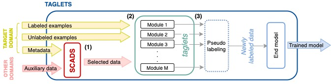

# TAGLETS:  A System for Automatic Semi-Supervised Learning with Auxiliary Data


TAGLETS is a system that automatically and efficiently exploits all available data, including labeled, unlabeled, and auxiliary data, for a given task to produce a single, robust classifier. TAGLETS extracts relevant auxiliary data for training using SCADs, a database of auxiliary data aligned with concepts in ConceptNet, and passes all relevant data to an ensemble of user-specified modules, which are trained and distilled into a final classifier.  



This is the codebase for all the experiments mentioned in [TAGLETS:  A System for Automatic Semi-Supervised Learning with Auxiliary Data](https://arxiv.org/abs/2111.04798).

For general use of TAGLETS, we recommend using [this up-to-date TAGLETS repository](https://github.com/BatsResearch/taglets) instead.

## Installation

The package requires `python3.7`. You first need to clone this repository:
```
git clone https://github.com/BatsResearch/taglets.git
```

Before installing TAGLETS, we recommend creating and activating a new virtual environment which can be done by the following script:
```
python -m venv taglets_venv
source taglets_venv/bin/activate
```

You also want to make sure `pip` is up-to-date:
```
pip install --upgrade pip
```

Then, to install TAGLETS and download related files, run:
```
bash setup.sh
```

## Datasets

Our experiments depend on four different datasets that you will need to download separately.

- [FMD](http://people.csail.mit.edu/celiu/CVPR2010/FMD/index.html): Download the database (.zip) and extract it. When asked to provide a path to this dataset later, please provide the path to the outmost directory of this dataset. 

- [GroceryStoreDataset](https://github.com/marcusklasson/GroceryStoreDataset): Download the repo as a zip file and extract it (or just clone the repo). When asked to provide a path to this dataset later, please provide the path to the inner `dataset` directory of this dataset.

- [Office-Home Dataset](https://www.hemanthdv.org/officeHomeDataset.html): Download the dataset (.zip) and extract it. When asked to provide a path to this dataset later, please provide the path to the inner `OfficeHomeDataset_10072016` directory of this dataset.

- ImageNet-21k

## Running the experiments

We recommend using 4 or more gpus to run the experiments. 

First, in the config file `acclerate_config.yml`, make sure `num_processes` match the number of gpus you are using:
```yml
compute_environment: LOCAL_MACHINE
distributed_type: MULTI_GPU
fp16: false
machine_rank: 0
main_process_ip: null
main_process_port: null
main_training_function: main
num_machines: 1
num_processes: 4 # set this number to the number of gpus
```

Then, you can run the experiments using the following script:
```
accelerate launch --config_file accelerate_config.yml run_semi.py \ 
    --dataset DATASET \
    --dataset_dir PATH_TO_YOUR_DATASET \
    --scads_root_path ROOT_PATH_OF_YOUR_SCADS \
    --data_seed DATA_SPLIT \
    --model_seed MODEL_SEED \
    --prune PRUNING_LEVEL \
    --model_type MODEL_TYPE \
    --batch_size BATCH_SIZE
```

Here are the descriptions of the arguments:

`--dataset`: Name of the dataset you want to run the experiment on `['fmd', 'office_home-product', 'office_home-clipart',
                                 'grocery-coarse']`

`--dataset_dir`: Path to the directory containing the chosen dataset

`--scads_root_path`: Root path of the images in your SCADS (This should be path to your ImageNet-21k directory)

`--data_seed`: Data split you want to run the experiment on 
(If `all` is input, the experiments for split 0, 1, and 2 will all be run)

`--model_seed`: Seed for your model
(If `all` is input, the experiments for seed 0, 1, and 2 will all be run)

`--prune`: Pruning level (Please specify -1 for no pruning)
(If `all` is input, the experiments for pruning level -1, 0, and 1 will all be run)

`--model_type`: Name of your backbone `['resnet50', 'bigtransfer']`

`--batch_size`: Batch size per gpu (your actual size batch size will be this multiplied by number of gpus


## Citation

Please cite the following paper if you are using our framework :)

```
@inproceedings{piriyakulkij:mlsys22,
  Author = {Wasu Piriyakulkij and Cristina Menghini and Ross Briden and Nihal V. Nayak and Jeffrey Zhu and Elaheh Raisi and Stephen H. Bach},
  Title = {{TAGLETS}: {A} System for Automatic Semi-Supervised Learning with Auxiliary Data},
  Booktitle = {Conference on Machine Learning and Systems (MLSys)},
  Year = {2022}}
```